# تحدي العقول (Mind Challenge)

مسابقة ثقافية عربية تختبر سرعة بديهتك بـ 360 سؤالاً في الإسلاميات والعلوم والأدب والتاريخ والألغاز والثقافة العامة.

تطبيق ويب تقدّمي (PWA) يعمل بدون إنترنت، مع خلفية صحراوية ثلاثية الأبعاد ومؤثرات صوتية مولّدة — بلا أي تبعية خارجية.

## من اللعبة

### القائمة الرئيسية — سمتان

| 🌙 ليلي صحراوي | ☀️ نهاري ساطع |
|:---:|:---:|
| 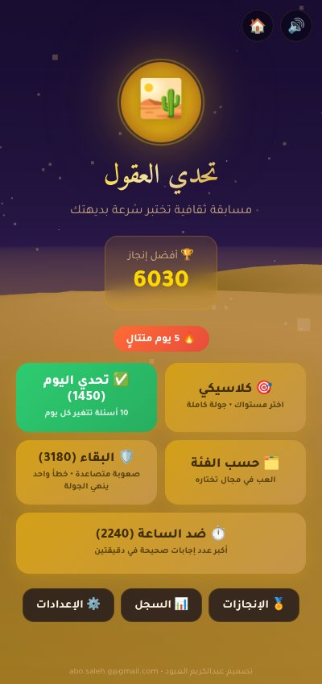 | 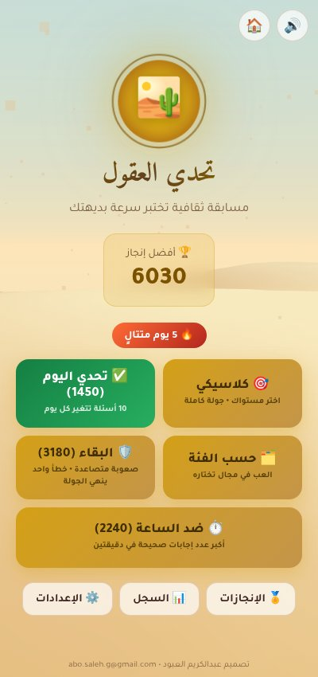 |

### اللعب

| اختيار المستوى | سؤال أثناء اللعب |
|:---:|:---:|
| 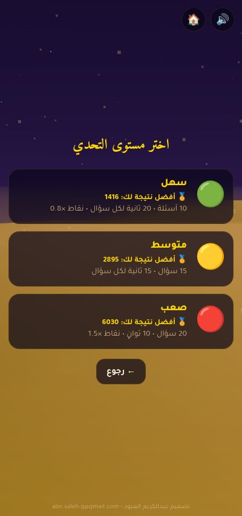 | 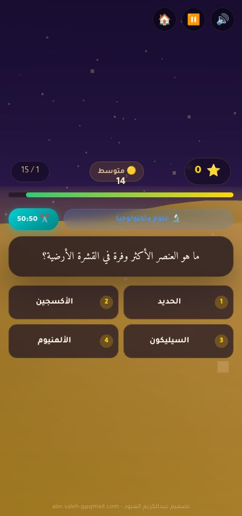 |

| الإجابة والشرح | إيقاف مؤقت |
|:---:|:---:|
| 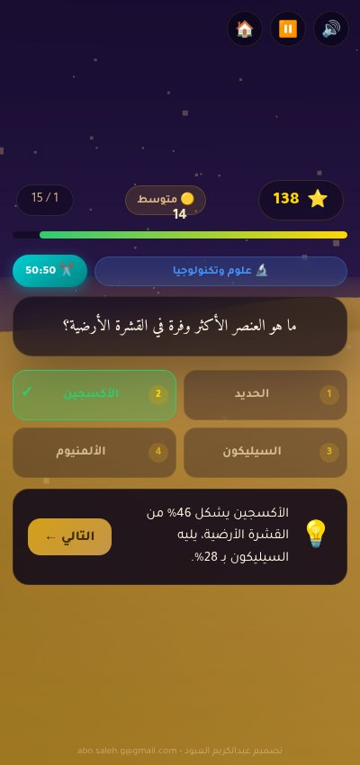 | 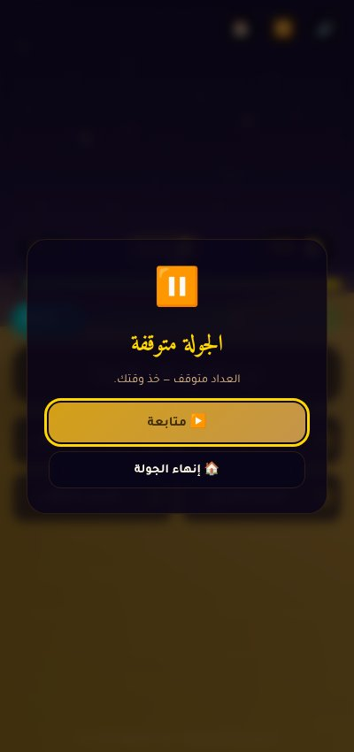 |

### بعد الجولة

| النتيجة | مراجعة الأخطاء |
|:---:|:---:|
| 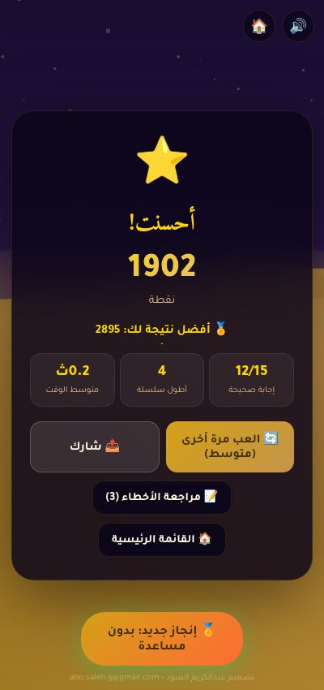 | 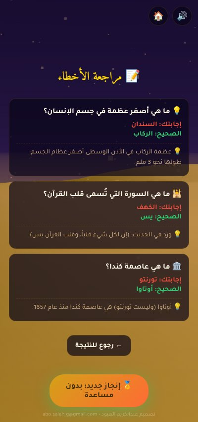 |

### التقدّم والإعدادات

| الإنجازات | سجل الجولات |
|:---:|:---:|
| 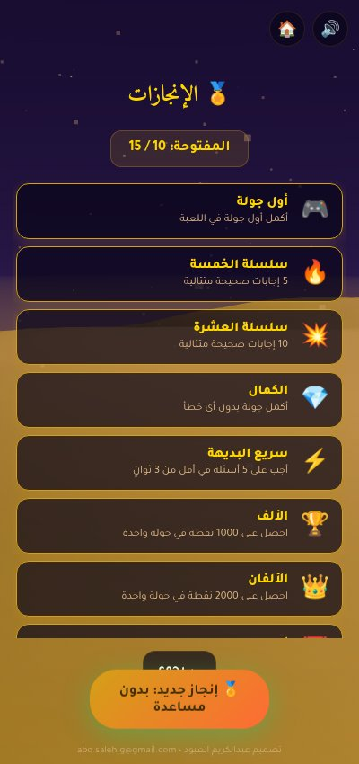 | 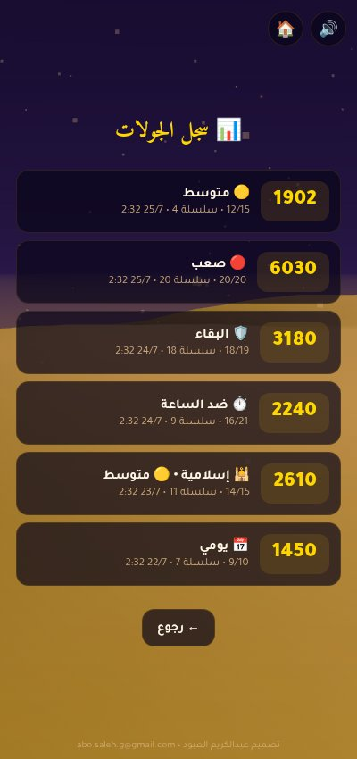 |

<p align="center">
  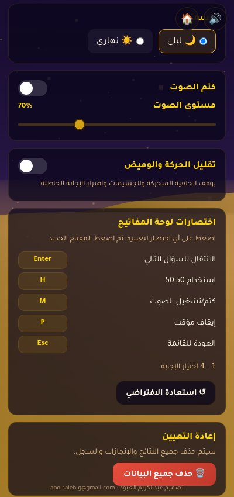
</p>
<p align="center"><sub>الإعدادات: السمة، مستوى الصوت، تقليل الحركة، وإعادة تعيين الاختصارات</sub></p>

## الميزات

- **6 فئات** ثقافية: ثقافة عامة، ألغاز ذكاء، إسلامية، تاريخ وجغرافيا، علوم وتكنولوجيا، أدب وشعر
- **3 مستويات صعوبة**: سهل (10 أسئلة × 20ث، نقاط ×0.8) / متوسط (15 × 15ث) / صعب (20 × 10ث، نقاط ×1.5)
- **تحدي اليوم**: 10 أسئلة ثابتة تتغير يومياً مع عداد أيام متتالية
- **وضع حسب الفئة**: العب في فئة واحدة تختارها (أو كل الفئات)
- **وضع البقاء**: أسئلة متصاعدة الصعوبة، وخطأ واحد ينهي الجولة
- **وضع ضد الساعة**: أكبر عدد إجابات صحيحة خلال دقيقتين
- **وسيلة مساعدة 50:50** لحذف إجابتين خاطئتين
- **شرح للإجابات** بعد كل سؤال
- **مراجعة الأخطاء** بعد الجولة: الأسئلة الخاطئة مع الإجابة الصحيحة والشرح
- **نظام إنجازات** بـ 15 شارة
- **سجل آخر 10 جولات** مع الإحصائيات
- **رقم قياسي مستقل لكل وضع ومستوى** — السهل والمتوسط يتنافسان على لوحتيهما
- **إيقاف مؤقت** يوقف العدّاد (ويعمل تلقائياً عند مغادرة التطبيق)
- **سمتان**: ليلي صحراوي / نهاري ساطع
- **دعم لوحة المفاتيح** مع إمكانية إعادة تعيين الاختصارات
- **يعمل بدون إنترنت** كـ PWA قابل للتثبيت
- **مصمم بالكامل بالعربية** مع دعم RTL ومراعاة الوصولية

## الوصولية

- **تباين مطابق لـ WCAG AA في السمتين** — السمة النهارية تعيد ضبط ألوان النص والحالة (`--sand` مثلاً 7.3:1 بدل 1.75:1)
- **الإجابة الصحيحة/الخاطئة تحمل رمز ✓/✗** إضافةً للّون، فلا تعتمد على تمييز الأحمر والأخضر
- **تقليل الحركة**: يُحترم `prefers-reduced-motion` من النظام، وهناك مفتاح داخل الإعدادات لمن لم يضبطه
- **مستوى صوت** قابل للتحكم إضافةً للكتم
- **إعادة تعيين اختصارات لوحة المفاتيح** (عدا 1-4 المحجوزة لاختيار الإجابة)
- **إدارة التركيز** عند تبديل الشاشات، مع حلقة تركيز واضحة على كل عنصر تفاعلي
- **مناطق آمنة** (`env(safe-area-inset-*)`) و`100dvh` لشاشات الجوال ذات النتوء

## التشغيل

نظراً لأن المشروع يستخدم `fetch` لتحميل الأسئلة، يجب تشغيله عبر خادم HTTP محلي:

```bash
python3 -m http.server 8000
# ثم افتح: http://localhost:8000
```

أو باستخدام Node:

```bash
npx serve
```

## تثبيت كتطبيق

افتح اللعبة في Chrome/Edge/Safari، ثم اضغط على زر "تثبيت التطبيق" في شريط العنوان أو من قائمة المتصفح.

## بنية المشروع

```
Challenges/
├── index.html          # هيكل الصفحة
├── styles.css          # كل التنسيقات
├── manifest.json       # إعدادات PWA
├── sw.js               # Service Worker للعمل offline
├── package.json        # سكربتات التطوير فقط (لا تبعيات)
├── js/
│   ├── utils.js        # دوال نقية مشتركة (عشوائية، اختيار الأسئلة، التسجيل)
│   ├── storage.js      # حفظ البيانات في localStorage
│   ├── audio.js        # توليد المؤثرات الصوتية
│   ├── gl.js           # أدوات WebGL مصغّرة (مصفوفات، شيدرات، أشكال)
│   ├── scene.js        # خلفية صحراوية ثلاثية الأبعاد
│   └── game.js         # منطق اللعبة الرئيسي
├── data/
│   └── questions.json  # قاعدة الأسئلة
├── scripts/
│   ├── validate-questions.mjs  # مدقق بنك الأسئلة
│   ├── validate-sw.mjs         # مدقق أصول الـ Service Worker
│   └── tests/                  # اختبارات node --test
├── docs/
│   └── screenshots/    # صور الاستعراض في هذا الملف (خارج حزمة التطبيق)
└── icons/
    ├── favicon.svg
    ├── icon-192.png
    ├── icon-512.png
    └── icon-512-maskable.png
```

## اختصارات لوحة المفاتيح

كل الاختصارات أدناه قابلة لإعادة التعيين من الإعدادات، عدا `1`-`4`:

| اختصار | الإجراء |
|--------|---------|
| `1` - `4` | اختيار الإجابة (محجوزة) |
| `Enter` / `Space` | الانتقال للسؤال التالي بعد الإجابة |
| `M` | كتم/تشغيل الصوت |
| `H` | استخدام وسيلة 50:50 |
| `P` | إيقاف مؤقت |
| `Esc` | العودة للقائمة الرئيسية |

## التطوير

التطبيق مكتوب بـ JavaScript خالص (Vanilla JS) بدون أي إطار عمل ولا أي تبعية وقت تشغيل. لا حاجة لخطوة build.

الخلفية الثلاثية الأبعاد مرسومة بـ WebGL خام عبر `js/gl.js` (مصفوفات، تصريف شيدرات، مولّدات كرة ومستوٍ). سابقاً كانت تعتمد على THREE.js r128 بحجم 603KB — أي أكثر من نصف حمولة التطبيق — مقابل أقل من 5% من المكتبة مستخدماً فعلياً.

سكربتات التطوير (تتطلب Node.js، بلا أي تبعيات):

```bash
npm run serve      # خادم محلي على المنفذ 8000
npm run validate   # تدقيق بنك الأسئلة وأصول الـ Service Worker
npm test           # اختبارات الوحدات لدوال الاختيار والعشوائية
```

عند تعديل أي ملف مُخزَّن في الكاش، ارفع رقم `CACHE_NAME` في `sw.js`.

لإضافة أسئلة جديدة، عدّل `data/questions.json` ثم شغّل `npm run validate`. كل سؤال له الحقول:
```json
{
  "cat": "general",            // الفئة
  "d": 2,                       // الصعوبة (1=سهل، 2=متوسط، 3=صعب)
  "q": "نص السؤال؟",
  "a": ["خيار1", "خيار2", "خيار3", "خيار4"],
  "c": 0,                       // فهرس الإجابة الصحيحة
  "e": "شرح الإجابة الصحيحة"
}
```

قواعد تحريرية للأسئلة:

- إجابة واحدة فقط قابلة للدفاع؛ إن كان السؤال خدعة فيجب أن يحسمها الشرح `e`
- عرف البنك: الإجابة الصحيحة أولاً (`"c": 0`) — الخلط يتم وقت التشغيل
- اكتب بالفصحى، وتجنّب الحقائق المرتبطة بتاريخ متغير (مثل «أحدث…» أو «حالياً…»)
- لا تكرر سؤالاً موجوداً ولو بصياغة مختلفة (المدقق يكتشف التكرار الحرفي فقط)

## المؤلف

تصميم: عبدالكريم العبود — abo.saleh.g@gmail.com
